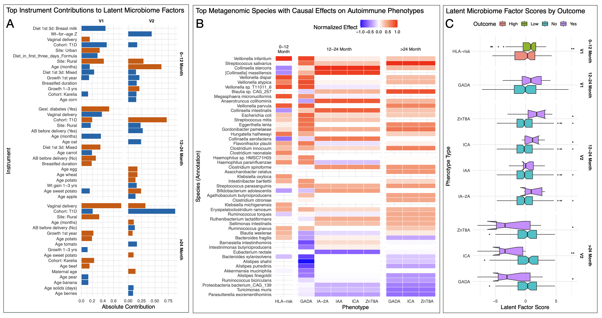
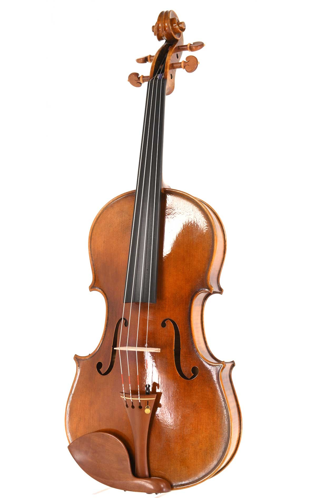

```{r setup, include=FALSE}
options(htmltools.dir.version = FALSE)
```

class: title-slide

# Finding causation in microbiome data: Instrumental factor models 

### Jiadong Mao, Melbourne Integrative Genomics

### 5M, 30 April 2026

.footnote[
Paper: *Moving from Association to Causation: Instrumental factor models for causal inference in high-dimensional multi-omics data*
]


---

# Three connected goals

Association is not causation, but what is causation?

--

.mini-table[
| Goal | Question | Useful for |
|---|---|---|
| Association | Which features vary with phenotype? | Biomarkers, hypotheses |
| Prediction | Which features predict new samples? | Classification, prognosis |
| Causation | What would happen under exposure (other variables kept the same)? | Mechanism, treatment design |
]

--
Example: *Ruminococcus gnavus* and inflammation

.small[
- Association: Do people with more *R. gnavus* tend to have more inflammation?
- Prediction: If I include *R. gnavus*, will prediction of inflammation be more accurate? 
- Causal: If we could reduce *R. gnavus* (keeping everything else the same), would inflammation decrease?
]

Prediction vs causation: smoke alarm


---

# Why microbiome and metabolomics are tricky

Or: Why DNA and RNA give us fewer headaches.

.mini-table[
| Layer | Rough stability | Causal implication |
|---|---|---|
| DNA / genotype | Very stable | Useful baseline, sometimes an instrument |
| RNA | Dynamic, regulated | Context-sensitive programs |
| Microbiome | Highly responsive | Cause, consequence, and transient shift can blur |
| Metabolome | Very transient | Reflects recent diet, host state, microbes, handling |
]

--

.callout[
'One or a few metabolites can not be markers, you have to find dozens (pathway-level enrichment).' -- A collaborator
]

That's why factorisation (for finding microbial/molecular programs) might help.

---

# Mini glossary

.cols[
.panel[
**Exposure**  
Variable whose effect we want, usually omics matrix <span class="math">X</span>.

**Outcome**  
Response <span class="math">y</span>, such as HCC or autoantibody status.

**Causal effect**  
What would change in <span class="math">y</span> under an intervention on <span class="math">X</span>.
]

.panel[
**Confounder**  
A cause of both <span class="math">X</span> and <span class="math">y</span>.

**Instrument**  
A variable <span class="math">Z</span> that shifts <span class="math">X</span> but has no direct path to <span class="math">y</span>.

**Factor**  
A low-dimensional axis summarizing coordinated variation.
]
]

---

# The confounding problem

<svg class="dag-svg" viewBox="0 0 760 260" role="img" aria-label="Confounding DAG">
  <defs>
    <marker id="arrow-conf" markerWidth="10" markerHeight="10" refX="8" refY="3" orient="auto" markerUnits="strokeWidth">
      <path d="M0,0 L0,6 L9,3 z" fill="#64748b"></path>
    </marker>
    <marker id="arrow-conf-h" markerWidth="10" markerHeight="10" refX="8" refY="3" orient="auto" markerUnits="strokeWidth">
      <path d="M0,0 L0,6 L9,3 z" fill="#a43f3f"></path>
    </marker>
  </defs>
  <line class="edge edge-h" x1="380" y1="94" x2="278" y2="153" marker-end="url(#arrow-conf-h)"></line>
  <line class="edge edge-h" x1="380" y1="94" x2="482" y2="153" marker-end="url(#arrow-conf-h)"></line>
  <line class="edge" x1="280" y1="180" x2="480" y2="180" marker-end="url(#arrow-conf)"></line>
  <rect class="node-fill node-h" x="320" y="38" width="120" height="58" rx="8"></rect>
  <text x="380" y="75" text-anchor="middle">H</text>
  <rect class="node-fill node-x" x="160" y="150" width="120" height="58" rx="8"></rect>
  <text x="220" y="187" text-anchor="middle">X</text>
  <rect class="node-fill" x="480" y="150" width="120" height="58" rx="8"></rect>
  <text x="540" y="187" text-anchor="middle">y</text>
</svg>

.cols[
.panel[
Observed association between <span class="math">X</span> and <span class="math">y</span> may indicate causality.
]
.panel[
May also be confounded by shared causes <span class="math">H</span>: diet, medication, inflammation, batch, environment.
]
]

---

# Instrumental variable (IV)

Due to confounding, not all variation of <span class="math">X</span> is useful.


<svg class="dag-svg" viewBox="0 0 820 270" role="img" aria-label="Instrumental variable DAG with hidden confounding">
  <defs>
    <marker id="arrow-iv" markerWidth="10" markerHeight="10" refX="8" refY="3" orient="auto" markerUnits="strokeWidth">
      <path d="M0,0 L0,6 L9,3 z" fill="#64748b"></path>
    </marker>
    <marker id="arrow-iv-z" markerWidth="10" markerHeight="10" refX="8" refY="3" orient="auto" markerUnits="strokeWidth">
      <path d="M0,0 L0,6 L9,3 z" fill="#3f7d20"></path>
    </marker>
    <marker id="arrow-iv-h" markerWidth="10" markerHeight="10" refX="8" refY="3" orient="auto" markerUnits="strokeWidth">
      <path d="M0,0 L0,6 L9,3 z" fill="#a43f3f"></path>
    </marker>
  </defs>
  <line class="edge edge-h" x1="430" y1="92" x2="384" y2="153" marker-end="url(#arrow-iv-h)"></line>
  <line class="edge edge-h" x1="430" y1="92" x2="590" y2="153" marker-end="url(#arrow-iv-h)"></line>
  <line class="edge edge-z" x1="170" y1="181" x2="300" y2="181" marker-end="url(#arrow-iv-z)"></line>
  <line class="edge" x1="420" y1="181" x2="560" y2="181" marker-end="url(#arrow-iv)"></line>
  <rect class="node-fill node-h" x="370" y="34" width="120" height="58" rx="8"></rect>
  <text x="430" y="71" text-anchor="middle">H</text>
  <rect class="node-fill node-z" x="50" y="152" width="120" height="58" rx="8"></rect>
  <text x="110" y="189" text-anchor="middle">Z</text>
  <rect class="node-fill node-x" x="300" y="152" width="120" height="58" rx="8"></rect>
  <text x="360" y="189" text-anchor="middle">X</text>
  <rect class="node-fill" x="560" y="152" width="120" height="58" rx="8"></rect>
  <text x="620" y="189" text-anchor="middle">y</text>
</svg>


- Only use part of <span class="math">X</span> traceable to external perturbations.

- Examples of <span class="math">Z</span>: antibiotics, diet, genetic knockouts, genotype.

---

# IV assumptions

<svg class="dag-svg dag-small" viewBox="0 0 860 250" role="img" aria-label="Antibiotics instrumental variable assumptions">
  <defs>
    <marker id="arrow-assump" markerWidth="10" markerHeight="10" refX="8" refY="3" orient="auto" markerUnits="strokeWidth">
      <path d="M0,0 L0,6 L9,3 z" fill="#64748b"></path>
    </marker>
    <marker id="arrow-assump-z" markerWidth="10" markerHeight="10" refX="8" refY="3" orient="auto" markerUnits="strokeWidth">
      <path d="M0,0 L0,6 L9,3 z" fill="#3f7d20"></path>
    </marker>
    <marker id="arrow-assump-bad" markerWidth="10" markerHeight="10" refX="8" refY="3" orient="auto" markerUnits="strokeWidth">
      <path d="M0,0 L0,6 L9,3 z" fill="#a43f3f"></path>
    </marker>
  </defs>
  <line class="edge edge-z" x1="175" y1="160" x2="330" y2="160" marker-end="url(#arrow-assump-z)"></line>
  <text class="label" x="252" y="175" text-anchor="middle">Relevance</text>
  <line class="edge" x1="465" y1="160" x2="620" y2="160" marker-end="url(#arrow-assump)"></line>
  <line class="edge edge-dash" x1="170" y1="137" x2="625" y2="137" marker-end="url(#arrow-assump-bad)"></line>
  <text class="label bad-label" x="330" y="132" text-anchor="middle">Exclusion</text>
  <line class="edge edge-h" x1="410" y1="75" x2="397" y2="132" marker-end="url(#arrow-assump-bad)"></line>
  <line class="edge edge-dash" x1="395" y1="70" x2="158" y2="132" marker-end="url(#arrow-assump-bad)"></line>
  <text class="label bad-label" x="250" y="85" text-anchor="middle">Exogeneity</text>
  <line class="edge edge-h" x1="462" y1="72" x2="665" y2="133" marker-end="url(#arrow-assump-bad)"></line>
  <rect class="node-fill node-z" x="35" y="135" width="140" height="50" rx="8"></rect>
  <text x="105" y="156" text-anchor="middle">antibiotics</text>
  <text x="105" y="175" text-anchor="middle">(Z)</text>
  <rect class="node-fill node-x" x="330" y="135" width="135" height="50" rx="8"></rect>
  <text x="397" y="156" text-anchor="middle">microbiome</text>
  <text x="397" y="175" text-anchor="middle">(X)</text>
  <rect class="node-fill" x="620" y="135" width="140" height="50" rx="8"></rect>
  <text x="690" y="156" text-anchor="middle">inflammation</text>
  <text x="690" y="175" text-anchor="middle">(y)</text>
  <rect class="node-fill node-h" x="360" y="25" width="140" height="50" rx="8"></rect>
  <text x="430" y="46" text-anchor="middle">health risk</text>
  <text x="430" y="65" text-anchor="middle">(H)</text>
</svg>

.mini-table[
| Assumption | Meaning | Example concern |
|---|---|---|
| Relevance | <span class="math">Z</span> changes <span class="math">X</span> | Do antibiotics shift the microbiome? |
| Exogeneity | <span class="math">Z</span> is not driven by hidden risk <span class="math">H</span> | Were antibiotics given because of high risk? |
| Exclusion | <span class="math">Z</span> affects <span class="math">y</span> only through <span class="math">X</span> | Do antibiotics affect inflammation through non-microbiome routes? |
]

---

# Example: Mendelian randomisation

.flow[
.node[Genotype Z]
.arrow[->]
.node.teal[Exposure X]
.arrow[->]
.node[Disease y]
]


Why it works when it works:

- genotype is fixed early
- often less confounded than measured exposure
- can create natural exposure variation


---

# Two-stage least squares 

.cols[
.panel[
**Stage 1**

Use <span class="math">Z</span> and <span class="math">Q</span> to explain <span class="math">X</span>.

.eq[
X ~ Z + Q
]
]

.panel[
**Stage 2**

Use the instrument-explained part of <span class="math">X</span> to explain <span class="math">y</span>.

.eq[
y ~ X̂ + Q
]
]
]

.callout[
The first stage isolates variation in <span class="math">X</span>. The second stage asks whether that variation relates to <span class="math">y</span>.
]


---

# Structural equations

Outcome model:

.eq[
y = Xα + Qφ + ε
]

First stage:

.eq[
X = Zβ + Qψ + E
]

Endogeneity:

.eq[
Cov(X, ε) ≠ 0
]

---

# Why classical IV struggles here

The first-stage coefficient matrix is large:

.eq[
β ∈ R<sup>d × p</sup>
]

Problems:

- <span class="math">p</span> can be much larger than <span class="math">n</span>
- <span class="math">Z</span> can also be multivariate
- features are correlated, sparse, compositional
- perturbations shift programs, not isolated features

---

# Factorisation

Factor: low-dimensional axis summarizing coordinated variation.


Omics examples: diet-associated metabolite program, antibiotic response axis.


Common factorisation methods: PCA, PLS (mixOmics), CCA (Seurat).

.mini-table[
| Method | Low-dimensional direction learned |
|---|---|
| PCA | High-variance directions in <span class="math">X</span> |
| Principal component regression | Directions in <span class="math">X</span> used to predict <span class="math">y</span> |
| Factor IV | Directions in <span class="math">X</span> explained by instruments <span class="math">Z</span> |
]

---

# Low-rank first stage

Instead of estimating all of <span class="math">β</span>, assume:

.eq[
β = UDV<sup>T</sup>, &nbsp; rank(β) = r ≪ min(d,p)
]

.mini-table[
| Notation | Dimension | Interpretation |
|---|---|
| <span class="math">U</span> | <span class="math">d × r</span> | Which instruments define each factor |
| <span class="math">D</span> | <span class="math">r × r</span> | Factor strength |
| <span class="math">V</span> | <span class="math">p × r</span> | Which features load on each factor |
]

---

# Instrumental factors

Define:

.eq[
F = ZUD
]

<span class="math">Z</span> is <span class="math">n × d</span>, <span class="math">U</span> is <span class="math">d × r</span>, <span class="math">D</span> is <span class="math">r × r</span>, so <span class="math">F</span> is <span class="math">n × r</span>.

Then:

.eq[
X = FV<sup>T</sup> + Qψ + E
]

.callout[
<span class="math">F</span> is the low-dimensional part of <span class="math">X</span> driven by the instruments.
]

---

# Outcome stage and feature effects

Factor-level outcome model:

.eq[
y = Fκ + Qφ + error
]

Map back to feature effects:

.eq[
α = Vκ
]

.callout[
Feature effects are reconstructed, structured effects, not independent feature-wise estimates (FDR control).
]

???

# Why factors inherit IV validity

If <span class="math">Z</span> is valid and:

.eq[
F = ZUD
]

then <span class="math">F</span> is a deterministic projection of the instruments.

.eq[
Cov(Z, ε | Q) = 0 &nbsp; ⇒ &nbsp; Cov(F, ε | Q) = 0
]

.callout.warn[
The hard part is still biological: whether <span class="math">Z</span> was valid in the first place.
]

---

# DIABIMMUNE infant microbiome

.small[
- age windows: 0-12, 12-24, >24 months
- <span class="math">X</span>: metagenomics microbiome features (single omics)
- <span class="math">Z</span>: HLA risk, delivery mode, feeding, environment
- <span class="math">y</span>: autoimmune phenotypes
]

<div class="case-figure">
```{r infant-gut-figure, echo=FALSE, out.width="60%", fig.align="center"}

```
</div>


---

# Mouse HCC multi-omics


- <span class="math">X</span>: 16S microbiome + serum metabolomics (stacked)
- <span class="math">Z</span>: high-fat diet, antibiotics, immune knockouts
- <span class="math">Q</span>: age, strain, body weight
- <span class="math">y</span>: HCC, NASH, obesity, immune phenotypes


- Dominant factor V1 links diet/antibiotics, microbe-metabolite structure, bile acids, and HCC-related phenotypes.

- *g. gnavus* would have been ignored if only do DESeq2 (HCC vs non-HCC).

.[
HCC: hepatocellular carcinoma 
]


---
class: title-slide

# Discussions


---

# Why multi-omics may help exclusion

Suppose biology is:

.flow[
.node[Z]
.arrow[->]
.node.teal[Microbiome]
.arrow[->]
.node.teal[Metabolome]
.arrow[->]
.node[y]
]

If metabolome omitted, part of the <span class="math">Z → y</span> path sits outside <span class="math">X</span> (omics).

.callout[
Adding omics layers can absorb more instrument-induced mediation. 
]

The paper simply stacked two omics, but can try e.g. DIABLO & DIVAS.


---

# What Factor IV estimates

.cols[
.panel[
**It is good for**

- perturbation-aligned omics programs
- high-dimensional <span class="math">X</span>
- structured feature effects
- multi-omics integration
]

.panel[
**It is not**

- unrestricted feature-wise causality
- replacement for biological judgment
- immune to preprocessing
]
]

- IV assumptions are not fully testable from observed data
- exclusion is often the hardest biological assumption

---

# Come talk to us

<div class="team-grid">
  <div class="team-member">
    
    <div class="team-name">Eva Wang</div>
  </div>
  <div class="team-member">
    
    <div class="team-name">Jiadong Mao</div>
  </div>
  <div class="team-member">
    
    <div class="team-name">Kshitij Tandon</div>
  </div>
  <div class="team-member">
    
    <div class="team-name">Lin Liu (Shanghai Jiao Tong)</div>
  </div>
  <div class="team-member">
    
    <div class="team-name">Saritha Kodikara (CSL)</div>
  </div>
</div>

<div class="team-grid instrument-grid">
  <div class="team-member">
    
  </div>
  <div class="team-member">
    
  </div>
  <div class="team-member">
    
  </div>
  <div class="team-member">
    
  </div>
  <div class="team-member">
    
  </div>
</div>


---

# Questions
